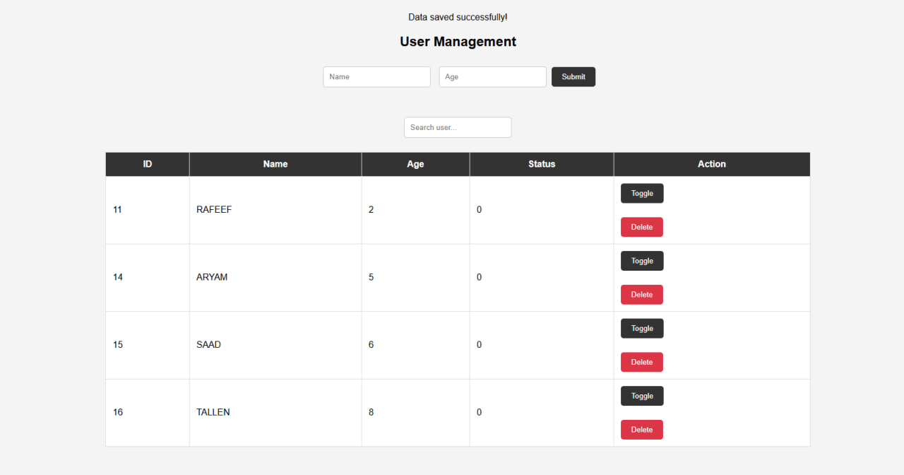

# User Management System

A simple web-based User Management System built using PHP, MySQL, HTML, CSS, and JavaScript.

## Project Preview



## Demo Video

🎥 [Watch the User Management System Demo](Usermangment.mp4)

## Features

* Add new users with name and age
* Store user data in a MySQL database
* Display all users in a table
* Toggle user status between `0` and `1`
* Search for users by name using JavaScript
* Delete users from the database
* Confirmation messages before deleting users or changing their status
* Form validation

## Technologies Used

* PHP
* MySQL
* HTML5
* CSS3
* JavaScript
* XAMPP
* phpMyAdmin

## Project Structure

```text
user-management-system/
├── index.php
├── delete.php
├── script.js
├── style.css
├── database.sql
├── screenshot.png
├── User mangment.mp4
└── README.md
```

## How to Run the Project

1. Install and open XAMPP.
2. Start Apache and MySQL.
3. Copy the project folder into the `htdocs` directory:

```text
C:\xampp\htdocs\
```

4. Open phpMyAdmin.
5. Create a database named:

```text
user_management
```

6. Import the `database.sql` file into the database.
7. Open the project in your browser:

```text
http://localhost/user_management/
```

## Database

The project uses a MySQL database named `user_management`.

The `users` table contains:

* `id` — User ID
* `name` — User name
* `age` — User age
* `status` — User status (`0` or `1`)

## Author

**Aryam Aseiri**

GitHub: **@0xaryam**

---

Developed as part of a Web & App Programming training task.
